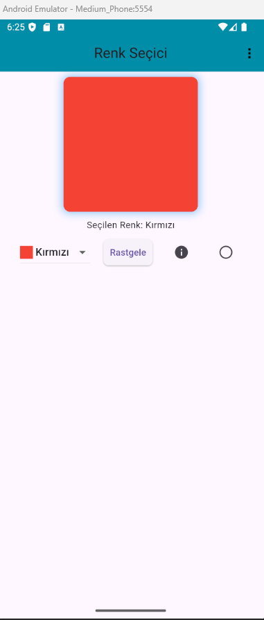

# 🎨 Flutter Color Picker App

Flutter ile geliştirilmiş basit ama işlevsel bir renk seçici uygulaması.  
Kullanıcı seçilen rengi anında görebilir, rastgele renk seçebilir, renk kodunu görüntüleyebilir ve kutunun şeklini kare/daire olarak değiştirebilir.

## 🚀 Özellikler

- Dropdown menüden renk seçme
- Rastgele renk atama butonu
- Seçilen rengin adını ve kodunu gösterme
- Kare ↔ Daire şekil değiştirme
- Toast mesajları ile kullanıcıya bilgi verme (`fluttertoast` paketi kullanıldı)

## 📱 Ekran Görüntüsü



## ⚙️ Kurulum

1. Repoyu klonla:

   ```bash
   git clone https://github.com/kullaniciAdi/flutter_color_picker_app.git

   ```

2. Proje klsörüne gir:
   cd flutter_color_picker_app

3. Paketleri yükle:
   flutter pub get

4. Uygulamayı çalıştır:
   flutter run
